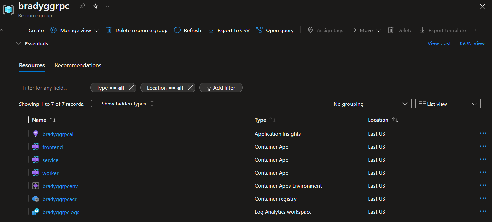
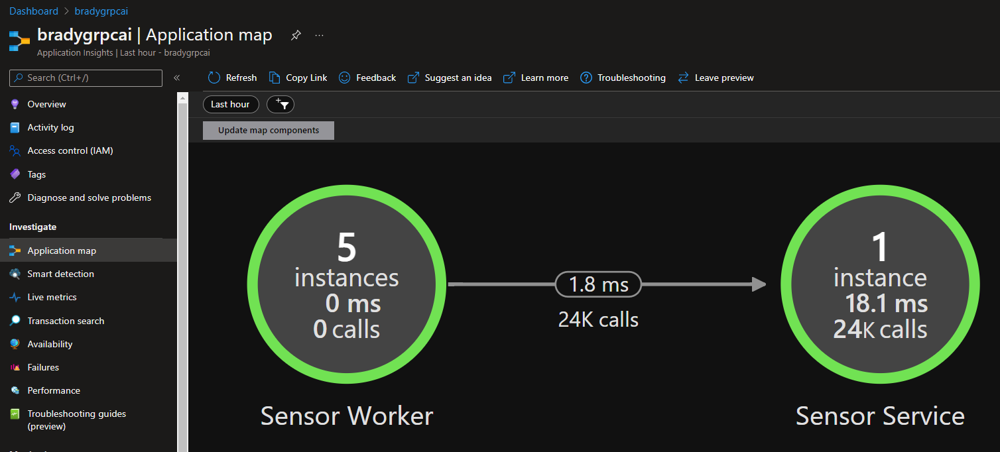

# ASP.NET gRPC backend + Worker + Web Frontend on Azure Container Apps

This repository contains a simple scenario built to demonstrate how ASP.NET Core 6.0 can be used to build a cloud-native application hosted in Azure Container Apps. The repository consists of the following projects and folders:

* **Frontend** - A front-end web app written using ASP.NET Core Blazor Server. This web app opens a connection to a gRPC service that streams data to it continuously. 
* **Monitoring** - A shared project that makes it simple to configure a .NET project with Application Insights monitoring. 
* **SensorService** - A .NET gRPC service that has two features - it receives data from the workers via individual gRPC request/response communication, but also streams data to the frontend Blazor app. 
* **SensorWorker** - A .NET Worker Service project that continuously sends data to the `sensorservicegRPC` service inside the cluster. Think of each instance of the `SensorWorker` project as a physical device twin, like a thermometer. 
* You'll also see a series of Azure Bicep templates and a GitHub Actions workflow file in the **Azure** and **.github** folders, respectively. 

## What you'll learn

This exercise will introduce you to a variety of concepts, with links to supporting documentation throughout the tutorial. 

* [Azure Container Apps](https://docs.microsoft.com/azure/container-apps/overview)
* [GitHub Actions](https://github.com/features/actions)
* [Azure Container Registry](https://docs.microsoft.com/azure/container-registry/)
* [Azure Bicep](https://docs.microsoft.com/azure/azure-resource-manager/bicep/overview?tabs=**bicep**)
* [gRPC](https://grpc.io/) and building [gRPC apps using ASP.NET Core](https://docs.microsoft.com/aspnet/core/grpc/?view=aspnetcore-6.0)

## Prerequisites

You'll need an Azure subscription and a very small set of tools and skills to get started:

1. An Azure subscription. Sign up [for free](https://azure.microsoft.com/free/).
2. A GitHub account, with access to GitHub Actions.
3. Either the [Azure CLI](https://docs.microsoft.com/cli/azure/install-azure-cli) installed locally, or, access to [GitHub Codespaces](https://github.com/features/codespaces), which would enable you to do develop in your browser.

## Topology diagram

This app is represented by 1 (or more) background worker apps that make repetitive requests via gRPC to a gRPC host container. That host container aggregates the data into a stream after storing it temporarily in Memory Cache. A final container, hosting a frontend Blazor Server application, has a streaming connection to the gRPC service. 


As the gRPC service receives data payloads from the individual worker instances, it streams that data constantly to the frontend web app, which displays a graph showing the data being received over time. The app demonstrates how a series of backend services can communicate internally within the Azure Container Apps environment using HTTP2 and gRPC. 

## Setup

By the end of this section you'll have a 3-node app running in Azure. This setup process consists of two steps, and should take you around 15 minutes. 

1. Use the Azure CLI to create an Azure Service Principal, then store that principal's JSON output to a GitHub secret so the GitHub Actions CI/CD process can log into your Azure subscription and deploy the code.
2. Edit the ` deploy.yml` workflow file and push the changes into a new `deploy` branch, triggering GitHub Actions to build the .NET projects into containers and push those containers into a new Azure Container Apps Environment. 

## Authenticate to Azure and configure the repository with a secret

1. Fork this repository to your own GitHub organization.
2. Create an Azure Service Principal using the Azure CLI. 

```bash
$subscriptionId=$(az account show --query id --output tsv)
az ad sp create-for-rbac --sdk-auth --name gRPCAcaSample --role contributor --scopes /subscriptions/$subscriptionId
```

3. Copy the JSON written to the screen to your clipboard. 

```json
{
  "clientId": "",
  "clientSecret": "",
  "subscriptionId": "",
  "tenantId": "",
  "activeDirectoryEndpointUrl": "https://login.microsoftonline.com/",
  "resourceManagerEndpointUrl": "https://brazilus.management.azure.com",
  "activeDirectoryGraphResourceId": "https://graph.windows.net/",
  "sqlManagementEndpointUrl": "https://management.core.windows.net:8443/",
  "galleryEndpointUrl": "https://gallery.azure.com",
  "managementEndpointUrl": "https://management.core.windows.net"
}
```

4. Create a new GitHub secret in your fork of this repository named `AzureSPN`. Paste the JSON returned from the Azure CLI into this new secret. Once you've done this you'll see the secret in your fork of the repository.

   

> Note: Never save the JSON to disk, for it will enable anyone who obtains this JSON code to create or edit resources in your Azure subscription. 

## Deploy the code using GitHub Actions

The easiest way to deploy the code is to make a commit directly to the `deploy` branch. Do this by navigating to the `deploy.yml` file in your browser and clicking the `Edit` button. 


Provide a custom resource group name for the app, and then commit the change to a new branch named `deploy`. 


Once you click the `Propose changes` button, you'll be in "create a pull request" mode. Don't worry about creating the pull request yet, just click on the `Actions` tab, and you'll see that the deployment CI/CD process has already started. 


When you click into the workflow, you'll see that there are 3 phases the CI/CD will run through:

1. provision - the Azure resources will be created that eventually house your app.
2. build - the various .NET projects are build into containers and published into the Azure Container Registry instance created during provision.
3. deploy - once `build` completes, the images are in ACR, so the Azure Container Apps are updated to host the newly-published container images. 


After a few minutes, all three steps in the workflow will be completed, and each box in the workflow diagram will reflect success. If anything fails, you can click into the individual process step to see the detailed log output. 

> Note: if you do see any failures or issues, please submit an Issue so we can update the sample. Likewise, if you have ideas that could make it better, feel free to submit a pull request.


With the projects deployed to Azure, you can now test the app to make sure it works. 

## Try the app in Azure

The `deploy` CI/CD process creates a series of resources in your Azure subscription. These are used primarily for hosting the project code, but there's also a few additional resources that aid with monitoring and observing how the app is running in the deployed environment. 
| Resource         | Resource Type             | Purpose                                                      |
| ---------------- | ------------------------- | ------------------------------------------------------------ |
| <prefix>grpcai   | Application Insights      | This provides telemetry about the application's execution, and stores traces, logs, and exception data captured by the Application Insights SDK. |
| frontend         | Container App             | Hosts the container with the code for the frontend Blazor server application that receives streaming data from the gRPC service. |
| service          | Container App             | Hosts the container with the code for the gRPC service that both receives requests from the individual Worker services and provides streaming data about the status of the individual workers. |
| worker           | Container App             | Hosts the container(s) with the code for the Worker Service that sends messages representing sensor data pings (like temperature sensors or light sensors). |
| <prefix>grpcenv  | Container App Environment | The Azure Container App Environment, in which all of the container apps running can communicate with one another relatively openly. |
| <prefix>grpcacr  | Azure Container Registry  | The container registry into which all of my application's microservices are published and stored prior to their being deployed as Azure Container Apps. |
| <prefix>grpclogs | Log Analytics             | A Log Analytics account, which provides container logs for all of the container app running in my container app environment. This is where you'll look for most `ILogger<T>` log output using [Kusto](https://docs.microsoft.com/azure/data-explorer/kusto/query/). |

The resources are shown here in the Azure portal:



Click on the `frontend` container app to open it up in the Azure portal. In the `Overview` tab you'll see a URL. 


Clicking that URL will open the app's frontend up in the browser. When it opens, you'll see a line chart that fluctuates as it receives data from the streaming gRPC API. 


## Scale the Worker

Now, you can scale out the `worker` container app to simulate multiple clients feeding into the gRPC service. To do this, go into the Revision management tool in the Azure portal, and you'll see the revision(s) currently active. You may see 2 revisions even though only one of the revisions is running your code, since the original deployment housed the Azure Container Apps welcome image, and the *second* deployment (the one performed during the `deploy` CI/CD step, since `provision` creates the Azure Container App with the default welcome image). 


Click the Create new revision button, and set the Scale slider to be anything more than 1.


Once the new revision is provisioned, you should see additional charts appear in the `frontend` web app. Each time a new `worker` starts up, it represents 1 device twin feeding data to the centralized gRPC `service` container app. 


## Monitoring

The application is instrumented with Azure Application Insights, and the Azure Container Apps environment has a Log Analytics dependency, so you can easily deep-dive into the logs from the application. 


You can also use the Application Insights Application Map to see a high-level overview of all the nodes and containers in the application, and to see how messages are being transmitted between each container through the Azure Container Apps environment. 



## Summary

This sample walks you through the creation of a distributed cloud-native app running in Azure Container Apps, which makes use of gRPC in both request/response and streaming APIs. You've also seen how to monitor and view the application's logs. Take some time and explore Azure Container Apps and what you can do with it as a solid host for your cloud-native .NET apps. 
